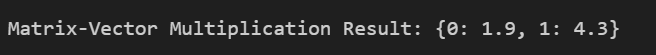
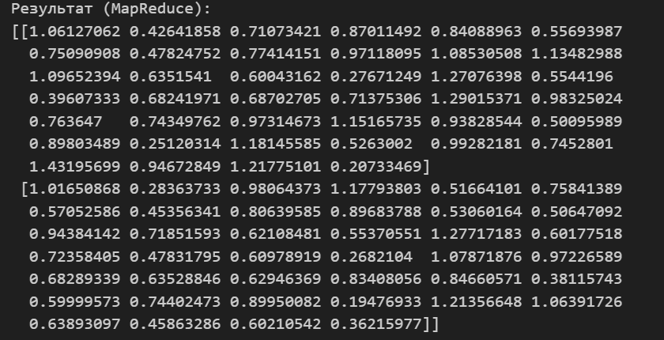

<!DOCTYPE html>
<h1> MapReduce модель обработки данных</h1>
<h1>Лабораторная работа №1</h1>
<h1>Выполнила: Максимова Алина </h1>

Максимальное значение ряда

Среднее арефметическое

GroupByKey на основе сортировки

 Drop duplicates (set construction, unique elements, distinct)

 Selection (Выборка)

 Projection (Проекция)

 Union (Объединение)

Intersection (Пересечение) 

Difference (Разница)

Natural Join 

Grouping and Aggregation (Группировка и аггрегация) 

 Matrix-Vector multiplication. Случай, когда вектор не помещается в памяти Map задачи

 Matrix multiplication (Перемножение матриц). Проверка

Реализуйте перемножение матриц  с использованием модельного кода MapReduce для одной машины в случае, когда обе матрицы генерируются в RECORDREADER. Например, сначала одна, а потом другая. 

Реализуйте перемножение матриц с использованием модельного кода MapReduce Distributed, когда каждая матрица генерируется в своём RECORDREADER.

Обобщите предыдущее решение на случай, когда каждая матрица генерируется несколькими RECORDREADER-ами, и проверьте его работоспособность. Будет ли работать решение, если RECORDREADER-ы будут генерировать случайное подмножество элементов матрицы? 

</html>

