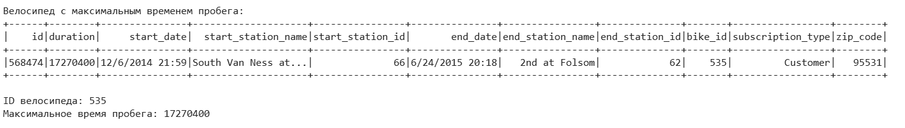
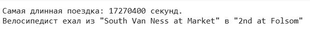
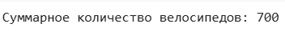
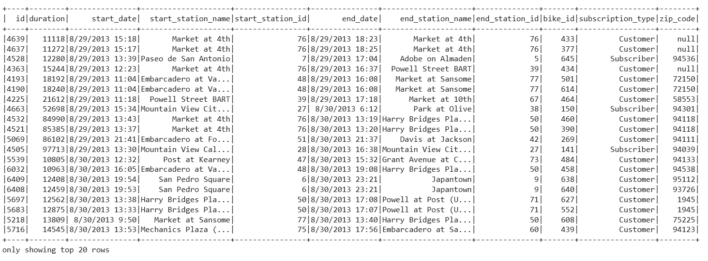

<!DOCTYPE html>

<h1> Введение в Apache Spark</h1>
<h1>Лабораторная работа №2</h1>
<h1>Выполнила: Максимова Алина </h1>

Найти велосипед с максимальным временем пробега.

Найти наибольшее геодезическое расстояние между станциями.

Найти путь велосипеда с максимальным временем пробега через станции.

Найти количество велосипедов в системе.

Найти пользователей потративших на поездки более 3 часов.

</html>
