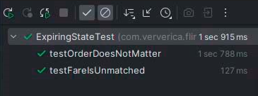
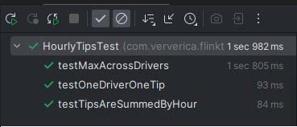
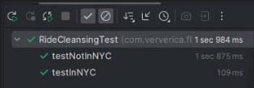
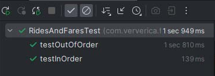

<!DOCTYPE html>

<h1>Потоковая обработка в Apache Flink</h1>
<h1>Лабораторная работа №3</h1>
<h1>Выполнила: Максимова Алина </h1>

Задание: 

1. ExpiringStateExercise

2. HourlyTipsExerxise

3. RideCleanisingExercise

4. RidesAndFaresExercise

</html>